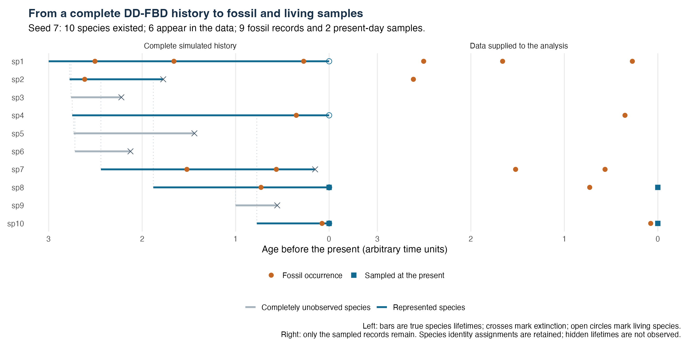

# Diversity-dependent fossilized birth-death in RevBayes

## A biological and implementation guide

**Version: 1 October 2026.** This guide describes the research implementation in this checkout: `dnDiversityDependentFBD`, also called `dnDDFBD`. It explains the model that is actually implemented, rather than a more general model that might be added later.

The aim is to infer a dated species tree and diversification parameters using **repeated fossil occurrences assigned to named species**, together with morphological data, molecular data, or both. Speciation depends on the number of species alive at that time, including species absent from the observed record. Extinction and fossil recovery have constant per-species rates.

The numerical likelihood, tree-to-character-data connection and short synthetic MCMC analyses have been tested. These tests are encouraging, but they are not a demonstration of statistical calibration, reliable parameter recovery or convergence on an empirical dataset. See [Section 16](#16-what-has-been-tested) for the evidence and its limits.

### Reading map

- [1. Biological idea](#1-the-biological-idea)
- [2. Parameters and assumptions](#2-parameters-and-biological-assumptions)
- [3. Data, unknowns and fixed information](#3-what-is-observed-and-what-is-inferred)
- [4. Why two trees are needed](#4-two-trees-for-two-different-purposes)
- [5. How unseen species enter the likelihood](#5-how-the-likelihood-accounts-for-unseen-species)
- [6. The complete Bayesian model](#6-the-complete-bayesian-model)
- [7. A simulated history mapped to data](#7-worked-example-from-a-complete-history-to-observed-data)
- [8. Executable mapping example](#8-evaluate-the-worked-example-in-revbayes)
- [9. Morphology and molecules](#9-connecting-morphology-and-molecules)
- [10. Geological age uncertainty](#10-fossil-age-uncertainty)
- [11. MCMC inference](#11-what-mcmc-changes)
- [12. Conditioning](#12-conditioning-on-how-the-dataset-was-selected)
- [13. Numerical approximation](#13-numerical-approximation-and-convergence)
- [14. Implementation map](#14-where-the-model-is-implemented)
- [15. Adapting the model to an empirical study](#15-moving-from-the-example-to-an-empirical-dataset)
- [16. Tests and limitations](#16-what-has-been-tested)
- [17. References and glossary](#17-references-and-glossary)

## 1. The biological idea

Imagine following a clade through time. Species originate, produce daughter species, become extinct, and occasionally leave fossil occurrences that enter our dataset. At the present, some living species are sampled.

The distinctive assumption is that speciation slows as the clade becomes more diverse. The model uses

\[
\lambda_N = \lambda_0\exp[-\alpha(N-1)],
\]

where **N is the total number of living species in the modeled clade**, not the number of fossils, sampled tips, or branches visible in the reconstructed tree.

This distinction matters. A lineage that subsequently becomes extinct without leaving an observed fossil still existed, occupied part of the modeled diversity, and affected the speciation rate while it was alive. Ignoring it would evaluate speciation using an incomplete diversity history.

We usually do not know how many such species existed. The likelihood therefore averages over compatible unseen histories. It does not first reconstruct one “best” hidden diversity curve and then treat that curve as certain.

Diversity dependence is a phenomenological assumption: it describes a relationship between diversity and diversification. A positive estimate of alpha alone would not identify competition, niche saturation, or any other particular mechanism as its cause. The clade boundary also matters: the current model has no additional diversity term for competitors outside the modeled clade.

## 2. Parameters and biological assumptions

### 2.1 Parameters

| Symbol | Rev argument | Meaning | Units |
|---|---|---|---|
| T | `originAge` | Age at which the process starts with one species | Time |
| lambda0 | `lambda0` | Per-species speciation rate when only one species is alive | Per unit time |
| alpha | `alpha` | Strength of the decline in speciation with diversity | Per species when diversity is a species count |
| mu | `mu` | Constant per-species extinction rate | Per unit time |
| psi | `psi` | Constant per-species rate of fossil occurrences entering the modeled dataset | Per unit time |
| rho | `rho` | Probability that a living species is sampled at the present | Probability |

All ages must use the same units. If ages are in millions of years, lambda0, mu and psi are rates per million years. The worked simulation below uses arbitrary time units.

“Constant extinction” means constant **per-species** extinction. The total extinction rate of a clade with N species is N times mu. Similarly, its total birth and fossil-occurrence rates are N times lambda_N and N times psi.

Alpha is nonnegative. At alpha = 0, the model has constant speciation; this provides an important numerical comparison with the corresponding constant-rate fossilized birth-death model. Larger alpha makes the decline steeper.

There is no hard carrying-capacity parameter in the exponential DD-FBD interface. If lambda0 > mu and alpha > 0, the continuous diversity value

\[
N_* = 1 + \frac{\log(\lambda_0/\mu)}{\alpha}
\]

is where the instantaneous per-species birth and death rates are equal. It is a balance point, not a maximum allowed diversity, a fixed expected diversity trajectory, or a guarantee that the clade persists.

### 2.2 Speciation is budding

At a speciation event, the parent species continues and a new daughter species begins. For example, species A can produce B and continue to exist alongside B. Fossils assigned to A before and after that split still belong to A.

This is **budding speciation**. The implementation does not also allow anagenetic species replacement or a split that terminates the parent and creates two new species identities. Those alternatives would require a different model or additional states.

At every retained branching, child 0 is the continuation of the parent and child 1 is the daughter. This order carries biological information. It is not just a convenient way to draw the tree.

### 2.3 Fossil recovery is an observation process

A fossil occurrence is a recovery event during a species' lifetime. It does not cause the species to become extinct. A species can have several occurrences.

Psi should be understood as the effective rate of records entering the defined dataset, incorporating the observation process the analysis is intended to represent. It is not necessarily the rate of fossil production in nature. Arbitrarily discarding interior occurrences while retaining only convenient records would change that observation process.

The current model assumes one common, time-constant psi. It does not explicitly model differences among formations, collection effort, geographic exposure or taxonomic preservation potential. Such heterogeneity can be biologically important; the present interface does not estimate it.

### 2.4 Present-day sampling

Each living species is sampled independently with probability rho. A fossil-bearing species can therefore be known to the analysis yet absent from the present-day sample.

“Absent from the present-day sample” is not synonymous with “extinct.” A living species can be omitted from a molecular dataset. In this implementation, however, whether each retained species is alive or extinct is supplied through the initial tree and stays fixed. Uncertainty in that discrete status is not sampled.

## 3. What is observed, and what is inferred?

### 3.1 The observation unit is a record, not a species range

The fossil input has one entry per recovered occurrence:

| occurrence ID | assigned species | true age, or geological age interval |
|---|---|---|
| specimen_01 | A | 4.0, or an interval such as 3.8-4.2 |
| specimen_02 | A | 2.0, or 1.8-2.2 |
| specimen_03 | B | 1.0, or 0.8-1.2 |

The first two entries are two occurrences of **one species**. They are not two independent species tips in the species-level diversification process.

In Rev, `occurrenceSpecies` stores the assignments, and `occurrenceAges` stores the corresponding ages. Their order must agree. Record IDs are also useful for connecting character rows to specimens, although the diversification distribution itself receives species names and ages rather than record IDs.

The present likelihood is for individual occurrence records. A first-last appearance interval alone does not encode all interior records or their count. Likewise, a database row representing a collection of many specimens is not automatically equivalent to one independently sampled fossil event. The observation unit must be defined consistently before fitting the model.

### 3.2 Character data are optional and can be incomplete

Morphological or molecular observations need a sample identifier, a species assignment, and an age. A fossil can contribute an occurrence record even if it has no character scores. A living sample can contribute DNA, morphology, both, or neither to a particular character partition.

A character-bearing fossil is included **once** in the occurrence process and is also a row in the character data. These are two kinds of information about the same sample, not two fossil-recovery events.

### 3.3 Observations, assumptions and latent quantities

| Quantity | Role in the current implementation |
|---|---|
| Species assignment of each fossil | Supplied and fixed |
| Character scores and sequences | Observed; missing entries are allowed |
| Fossil age | Fixed if treated as exact, otherwise a sampled variable constrained by dating information |
| Names of species sampled at present | Supplied and fixed |
| Living versus extinct status of each retained species | Fixed by the initial tree |
| Species relationships and budding orientation | Can be inferred by MCMC |
| Internal node ages and origin age | Can be inferred |
| True extinction time of an extinct retained species | Can be inferred; not set equal to its youngest fossil |
| lambda0, alpha, mu, psi | Can be inferred when assigned priors and moves |
| rho | Can be fixed or given a prior; the supplied joint examples fix it |
| Character-model parameters and clocks | Can be inferred through the usual Rev components |
| Completely unobserved histories | Integrated out by the likelihood calculation |

The current likelihood calculation does not output posterior samples of complete hidden histories or a posterior diversity-through-time curve. Marginalizing those histories is not the same operation as drawing and saving them. Additional posterior reconstruction machinery would be needed for that output.

## 4. Two trees for two different purposes

### 4.1 The extended species tree

The diversification distribution uses an **oriented extended species tree** with one endpoint per observed named species. “Observed” means that the species has at least one supplied fossil occurrence or a sampled living representative.

A positive-age endpoint is that species' latent, actual extinction time. An endpoint at age zero represents a living species. A sampled parent species keeps its own endpoint even when it has sampled daughter species.

Suppose B's youngest fossil is 1.0 time units old and B became extinct at age 0.4. The species tree ends B at 0.4; the fossil observation remains at 1.0. Setting the endpoint to 1.0 would incorrectly equate last observation and extinction.

The tree also has an origin stem: the process begins at T, potentially older than the oldest retained branching. `originAge` is supplied separately from the tree's root age.

### 4.2 The observation tree

Character likelihoods require a tree whose observations occur at the ages of the actual fossils and living samples. `fnSpeciesObservationTree` constructs that tree from the extended species tree and the sample metadata.

It follows the parent-continuation paths, inserts observations at their ages, and removes endpoint portions that have no character observations below them. Serial observations along one lineage are represented using sampled-ancestor tips with zero-length side branches, as expected by the character likelihood machinery.

This represents observations along a species lineage. It need not be interpreted as evidence that the particular fossil individual was literally the ancestor of a later sampled individual.

**Do not attach fossil characters directly to the extinction endpoints of the extended species tree.** That would give the characters the wrong ages and potentially the wrong relationships.

### 4.3 A subtle distinction: attachment versus species origin

The retained branch leading to species i begins at a structural attachment age b_i. Its oldest observation is at age o_i. Before that first observation, the path can pass through a species replacement caused by a hidden budding event: the parent becomes unrepresented and the path follows its daughter.

Consequently, **b_i need not equal the true biological origination time of species i**. The model integrates over possible identity changes before the first observation. Calling every retained attachment an estimated species-origination date would overinterpret the representation.

Once an observation fixes the identity, that identity must continue to the species' true extinction/present endpoint. The implementation calls this part of the path **protected**. Protection is a bookkeeping constraint on species identity. It does not make the species immortal: extinction is represented at its endpoint, while fossil recovery and the production of daughters remain possible during its lifetime.

## 5. How the likelihood accounts for unseen species

### 5.1 The biological explanation

For any proposed extended tree, imagine all compatible complete histories that could have produced its observations. Some have few unobserved species; others have more. Each history has a probability density determined by speciation, extinction, recovery and present sampling.

The likelihood adds their contributions. Higher diversity changes the birth rate within those histories, so the contributions cannot generally be calculated by treating the observed branches as independent ordinary birth-death processes.

The implementation avoids explicitly listing every complete history. Between observed events it tracks:

- k: retained species-tree branches crossing the time slice;
- s: retained branches whose species identity is already protected;
- h: additional living lineages not represented by those branches.

Thus total diversity is **N = k + h**, and 0 <= s <= k. Given a proposed tree and fossil ages, k and s follow a known schedule. The likelihood sums over h.

“Hidden” here is a time-slice classification. A completely unrecorded ancestral species can temporarily lie on a retained path before the first observation of a descendant species. The count h is not simply a permanent list of all taxon names absent from the dataset.

### 5.2 Optional mathematical detail

Let v_h be the unnormalized weight of compatible embedded histories with h additional lineages. Use elapsed time u, increasing from the origin toward the present. Between scheduled events,

\[
\frac{dv_h}{du}=
(h-1+2k-s)\lambda_{k+h-1}v_{h-1}
+(h+1)\mu v_{h+1}
-(k+h)(\lambda_{k+h}+\mu+\psi)v_h.
\]

Terms with negative indices are omitted. The birth rate is evaluated at the number of species **before** the event.

The upward coefficient h+2k-s has three contributions. A hidden lineage can produce another hidden lineage; a retained lineage can produce a hidden daughter; and an unprotected retained path can follow a daughter while the parent becomes hidden. That third possibility is disallowed once it would replace an already observed species identity.

This is a **weighted tree-embedding calculation**, not an ordinary probability-conserving population-count process. Its coefficients account for alternative ways a complete history can contain the retained tree. Replacing its diagonal by minus the sum of the allowed off-diagonal transitions would change the model.

The separate [mathematical derivation](EXTENDED_TREE_DERIVATION.md) explains why a scalar hidden count is sufficient under these particular assumptions. It is not a proof that one count is sufficient for every possible species-aware fossil model.

### 5.3 What happens at observed events?

| Event or boundary | Likelihood operation | Biological meaning |
|---|---|---|
| Retained budding event | Multiply each v_h by lambda_(k+h), then increase k | A represented daughter lineage begins |
| Fossil occurrence | Multiply by psi | A recovered record occurs |
| Oldest observation of a species | Increase s | Its named identity must now persist to its endpoint |
| True extinction endpoint | Multiply by mu, then decrease k and s | A retained species actually becomes extinct |
| Present | Apply sampling weights and sum over h | Sampled and unsampled survivors are accounted for |

Because psi is constant, the code collects the F fossil-event factors into psi^F rather than multiplying at every record time. The ages still determine identity constraints, protection boundaries and the character-observation tree.

For fixed endpoints and first observations, moving an interior fossil within an already protected interval need not change the diversification density under constant psi. Its presence still changes the record count, and its age can still affect the dating and character likelihoods. The model should not manufacture extra temporal information from a homogeneous sampling process.

At the present, if l retained species are sampled and r retained species are alive but not sampled, the raw density is

\[
L_{\mathrm{raw}}=
\sum_{h\geq0}v_h\rho^l(1-\rho)^{r+h}.
\]

A fossil-bearing living species absent from `sampledExtant` receives a factor 1-rho. An unobserved living lineage does too. If rho = 1, every living species must be sampled.

The implemented oriented, labelled-tree density also includes 1/n!, where n is the number of retained species. There is no additional factor 2^(n-1), because parent/daughter orientation is explicitly part of the state. This convention matters when comparing absolute log densities to other software or formulas.

## 6. The complete Bayesian model

Write E for the extended species tree, F for the fossil occurrences and species assignments, a for uncertain sample ages, theta for the diversification/sampling parameters, and eta for character-model parameters. Let O(E,a) be the deterministic observation tree.

A schematic posterior is

\[
\begin{aligned}
p(E,a,\theta,\eta\mid F,D_{\rm morph},D_{\rm DNA},G)
\propto\;&L_{\rm DDFBD}(E,F\mid a,\theta)\\
&\times L_{\rm morph}(D_{\rm morph}\mid O(E,a),\eta_{\rm morph})\\
&\times L_{\rm DNA}(D_{\rm DNA}\mid O(E,a),\eta_{\rm DNA})\\
&\times L_{\rm dating}(G\mid a)\;p(\theta,\eta,a).
\end{aligned}
\]

Here G denotes geological dating information. A missing character partition is omitted. The formula is schematic about age priors versus dating likelihoods: include the chosen dating information once, with an appropriate prior if needed, rather than duplicating the same age constraint in multiple factors.

The DD-FBD contribution is a **joint tree-and-occurrence density**. Although it is implemented as a Rev tree distribution whose arguments include the occurrence data, its value contains information about fossil recovery, counts and times. It is not merely a shape prior after discarding the probability of the observed fossil records.

In the small example, bounded uniform fossil-age variables provide the dating weights. With fixed interval endpoints their normalizing constants do not vary with the proposed age. More complex dating information, including shared stratigraphic ages, needs its own suitable model.

The character processes are conditionally independent partitions given their tree and parameters. The examples use continuous-time character evolution along the projected tree. They do not introduce extra character changes at unobserved speciation events. A model in which hidden splits produce special character jumps, inherited clock regimes or other persistent state would need additional hidden information.

## 7. Worked example: from a complete history to observed data

### 7.1 A genuine process simulation

The independent [complete-history simulator](../../validation/DDFBD/simulate_history.py) generated the saved [seed-7 example](../../validation/DDFBD/example_seed7/manifest.json). Its parameters are:

| Parameter | Value |
|---|---:|
| Origin age | 3.0 |
| lambda0 | 0.8 |
| alpha | 0.15 |
| mu | 0.25 |
| psi | 0.7 |
| rho | 0.8 |

This draw was unconditional: it was not selected by repeatedly simulating until a particular number of fossils or species appeared. A different seed could yield fewer records or no observations.

Ten species existed during the history. Six became extinct and four survived to the present. Six distinct species entered the dataset through nine fossil occurrences; two of the four living species were sampled at the present. The four completely unrecorded species were sp3, sp5, sp6 and sp9.



**Figure 1.** The left panel is available because this is a simulation: it shows the actual species lifetimes, including unrecorded species. The right panel shows the nine fossils and two present samples. The unknown history on the left is not supplied as observed data in an empirical analysis. Empty rows for unrecorded species only align the two panels; they are not supplied taxon entries. The known living/extinct statuses used by this implementation are additional metadata, discussed below.

The figure can be regenerated with [render_seed7_mapping.R](render_seed7_mapping.R). A [vector SVG](figures/seed7_data_mapping.svg) is also provided.

### 7.2 What the fossil table contains

The following are the actual saved occurrences, rounded for readability. The input files retain full precision.

| Record | Assigned species | Age before present |
|---|---|---:|
| occ1 | sp2 | 2.614692 |
| occ2 | sp1 | 2.504911 |
| occ3 | sp1 | 1.660439 |
| occ4 | sp7 | 1.521497 |
| occ5 | sp8 | 0.728629 |
| occ6 | sp7 | 0.564550 |
| occ7 | sp4 | 0.351232 |
| occ8 | sp1 | 0.272378 |
| occ9 | sp10 | 0.076038 |

Sp1 has three fossil occurrences and sp7 has two. They are repeated observations of their respective species. The original [occurrences.tsv](../../validation/DDFBD/example_seed7/occurrences.tsv) has equal `age_min` and `age_max` because this simulation records exact ages; those column names do not mean that an interval-count likelihood is implemented.

In a real study, the same table could contain collection or specimen IDs, taxonomic assignments and geological age bounds. Taxonomic assignments would currently be treated as correct and fixed. No names or fossil records are invented for sp3, sp5, sp6 or sp9.

### 7.3 Species information, and what is only simulation truth

| Species represented in the data | Fossil records | Sampled at present? | True status in this simulation | True endpoint age |
|---|---:|---|---|---:|
| sp1 | 3 | No | Living | 0 |
| sp2 | 1 | No | Extinct | 1.774691 |
| sp4 | 1 | No | Living | 0 |
| sp7 | 2 | No | Extinct | 0.149844 |
| sp8 | 1 | Yes | Living | 0 |
| sp10 | 1 | Yes | Living | 0 |

The positive endpoint ages in this table are **simulation truth, not observed fossil dates**. In an inference analysis they are latent and may move. Sp7's youngest fossil is approximately 0.564550, whereas its true extinction is approximately 0.149844. The unrecorded interval between them is about 0.4147 time units.

The present-day sampling list is simply sp8 and sp10. Sp1 and sp4 are alive but not selected into that present-day sample. For an empirical use of this fixed-status implementation, declaring these species alive requires external status information; their fossil records alone do not establish that fact. Using the simulated statuses here makes the demonstration a known-status analysis.

At the present, all four living species happen to have fossil records, so this particular complete history has no entirely hidden living species. The terminal sampling contribution for their particular labelled sampling outcomes is rho^2(1-rho)^2 = 0.0256. There is no binomial “choose two of four” multiplier because the sampled identities are specified.

### 7.4 Hidden diversity changes the rate

At age 2.4, the simulated clade contains seven living species: sp1, sp2, sp3, sp4, sp5, sp6 and sp7. Four retained paths cross this slice, so k = 4 and the actual simulated hidden count is h = 3. Two of those retained paths have already acquired a protected identity, so s = 2.

The correct per-species rate for this complete history is

\[
\lambda_7=0.8\exp[-0.15(7-1)]\approx0.3253.
\]

Using only its four retained branches would instead give lambda_4 approximately 0.5101. That would overestimate the per-species rate at this instant by about 57%. The model does not know the true h = 3 during inference; it sums the contributions from compatible hidden-count histories.

| Total living diversity | Per-species speciation rate |
|---:|---:|
| 1 | 0.8000 |
| 4 | 0.5101 |
| 7 | 0.3253 |
| 10 | 0.2074 |

### 7.5 An example of attachment not equalling origination

In the saved extended tree, the path ending in sp4 attaches at age 2.761290. But sp4's true birth was later, at age 2.748379. The earlier attachment marks the birth of the unrecorded parent sp3; a subsequent hidden birth leads to sp4.

Sp4's first fossil is much younger, at age 0.351232. Its identity was not fixed by an observation during that early part of the path, so the likelihood can integrate over this hidden identity change. This is why structural attachment ages must not automatically be reported as species origination times.

## 8. Evaluate the worked example in RevBayes

The runnable [seed7_mapping.Rev](../../examples/DDFBD/seed7_mapping.Rev) evaluates the saved simulated extended tree and constructs its observation tree. Run it from the **RevBayes repository root**, the nested `rb-fbdp/revbayes` directory:

```sh
.local-build/revbayes-build/rb examples/DDFBD/seed7_mapping.Rev
```

The central distribution call is:

```rev
initial <- readTrees("validation/DDFBD/example_seed7/extended_tree.nwk")[1]

occurrence_species <- v("sp2","sp1","sp1","sp7","sp8",
                        "sp7","sp4","sp1","sp10")
# Full-precision occurrence_ages are provided in the executable script.

species_tree ~ dnDDFBD(
    originAge=3.0, lambda0=0.8, alpha=0.15,
    mu=0.25, psi=0.7, rho=0.8,
    occurrenceSpecies=occurrence_species,
    occurrenceAges=occurrence_ages,
    sampledExtant=v("sp8","sp10"),
    initialTree=initial, condition="none",
    maxHiddenLineages=128, numericalTolerance=1e-13)

print(species_tree.lnProbability())
```

The tested script returns a labelled, unconditioned DD-FBD log density of approximately **-33.8822**. Changing the hidden cutoff from 128 to 256 changes it by about 2.6e-13. It also verifies six species endpoints, eleven observation tips, and the age of every observation tip.

This is an evaluation at the saved generating parameters and retained tree, **not a posterior estimate**. The density integrates over compatible unobserved histories. It therefore need not equal the saved complete-history log density of -41.1710, which evaluates one particular fully specified history and uses a different represented object/measure.

The projected observation tree contains record names occ1 through occ9 and living sample names sp8_now and sp10_now. These names can identify rows of a character matrix. The mapping script does not invent or simulate character scores for those rows.

Newick import deserves care: branch lengths alone may not preserve the intended absolute ages in an all-extinct tree, and the root branch should not be relied on to supply the process origin. This example has living endpoints anchoring age zero and passes `originAge` explicitly. The simulator's [extended_tree.json](../../validation/DDFBD/example_seed7/extended_tree.json) records authoritative node and endpoint ages.

## 9. Connecting morphology and molecules

### 9.1 The connection in Rev

The model is modular. After defining the species tree, construct the observation tree from sample metadata, then use it in the character likelihoods:

```rev
observation_tree := fnSpeciesObservationTree(
    species_tree,
    sampleNames=sample_names,
    speciesNames=sample_species,
    ages=sample_ages)

morphological_data ~ dnPhyloCTMC(
    tree=observation_tree, Q=fnJC(2),
    branchRates=morph_clock,
    type="Standard", coding="variable")
morphological_data.clamp(morph)

molecular_data ~ dnPhyloCTMC(
    tree=observation_tree, Q=fnJC(4),
    branchRates=dna_clock, type="DNA")
molecular_data.clamp(dna)
```

This is a wiring illustration: the character matrices, clocks, sample vectors and upstream species tree must already be defined. Complete examples are linked below.

The matrices in the shipped example use simple binary symmetric morphological evolution and a simple four-state DNA model. These are teaching choices, not claims that those substitution models are appropriate for every dataset. Each partition can have its own rate and substitution parameters.

The shared observation tree is the union of relevant sample rows. A fossil with no DNA can have missing DNA states while still contributing morphology and occurrence information. Occurrences lacking all character data remain in the fossil likelihood; they need not be included as scored rows in a character partition.

### 9.2 A small joint-data example already in the repository

The [joint Rev example](../../examples/DDFBD/model.Rev) uses a separate, deliberately small **synthetic teaching dataset**, not the ten-species seed-7 simulation above. It contains three named species A, B and C:

| Character row | Species | Age information | Morphology | DNA |
|---|---|---|---|---|
| A_old | A | 3.8-4.2 | Scored | Missing |
| A_young | A | 1.8-2.2 | Scored | Missing |
| B_old | B | 1.8-2.2 | Scored | Missing |
| B_young | B | 0.8-1.2 | Scored | Missing |
| C_fossil | C | 0.8-1.2 | Scored | Missing |
| A_now | A | 0 | Scored | Scored |
| C_now | C | 0 | Scored | Scored |

There are five fossil events and two present samples, but only three species endpoints. B is extinct; its starting endpoint is 0.4, younger than its youngest starting fossil at 1.0. Its extinction age is allowed to move during MCMC.

The [morphological matrix](../../examples/DDFBD/data/morphology.nex) has eight synthetic variable binary characters. For example, A_old is `00110011` and A_young is `00110111`: the same named species can change character states through time. The [DNA matrix](../../examples/DDFBD/data/dna.nex) has 24 sites for the two living samples, with missing states in fossil rows. These illustrative scores are not claimed to be a simulated character realization of the seed-7 history or an empirical dataset.

The example uses `coding="variable"` because its morphological characters were selected to be variable. A real matrix needs an ascertainment correction matching its actual construction. Excluding both invariant characters and some variable character classes is not the same rule as excluding invariant characters alone.

Do not copy a species-composite morphological row into every fossil occurrence and count those duplicates as independent character observations. Prefer specimen-level scores with their sample ages, or specify a justified model for the composite data. The implementation also does not model within-species polymorphism, coalescent genealogies or observational error merely by allowing several rows from one species.

## 10. Fossil-age uncertainty

A fossil's true age can be a stochastic Rev variable. In the joint example:

```rev
fossil_age[1] ~ dnUniform(3.8, 4.2)
```

The **same variable** is used in `occurrenceAges` and in the observation tree's sample-age vector. When MCMC changes its age, it changes the fossil's position in both the diversification model and the character tree.

Using two independent age variables for one specimen would allow its fossil record and its character row to occupy different times. The tests specifically check this connection.

The current implementation accepts proposed exact ages at each likelihood evaluation; it does not analytically integrate an age interval inside `dnDDFBD`. MCMC supplies the integration over uncertain ages through repeated proposals. Independent uniform intervals are only the teaching example's dating model. Fossils from a common horizon may need a shared age variable or a correlated dating model.

A first-last species range, an interval containing one uncertain specimen age, and an interval containing an unknown number of occurrences are three different data objects. The current likelihood directly supports the second through sampled ages and individual records. It does not directly implement the first or third as range-only or interval-count likelihoods.

## 11. What MCMC changes

A typical iteration proposes a change, reevaluates the affected parts of the model, and accepts or rejects it according to its posterior probability and proposal ratio.

The joint examples provide moves for diversification rates, alpha, origin age, fossil ages, character clocks, internal times, budding orientation/topology, and extinct endpoint ages. The extended tree's number of retained species and their names stay fixed, because the observed species list is fixed. Hidden species numbers can vary within the marginalized histories without adding explicit tree tips to the MCMC state.

The core topology move is `mvOrderedTreeSwap`. It preserves the ordered child slots, and its reversible swaps can also change which lineage is the ancestral continuation. Generic topology moves that reorder children without accounting for these roles should not be assumed interchangeable with it.

Impossible states have zero density: for example, a fossil younger than its species' extinction endpoint, or a tree placing an occurrence before the appropriate species path exists. This gives the observed records a role in constraining topology and times.

In the three-species example, B's extinction-time proposal has an upper bound linked to the current age of B's youngest fossil. It is not fixed to the younger end of that fossil's geological interval, which would exclude valid states. The bounds have names and are included in `model(...)` so Rev can reconnect the proposal's graph when it clones the model.

To run the complete demonstrations:

```sh
cd examples/DDFBD
../../.local-build/revbayes-build/rb combined.Rev
../../.local-build/revbayes-build/rb morphology.Rev
../../.local-build/revbayes-build/rb dna.Rev
```

Each entry script runs 2,000 generations and writes scalar traces, extended species trees and observation trees into its `output` directory. That length is a demonstration setting, not a recommendation for a scientific analysis. The shared [model.Rev](../../examples/DDFBD/model.Rev) is the authoritative complete specification, including illustrative priors.

A tree drawn at initialization is not claimed to be a random prior realization. Initialization restores the supplied compatible starting tree. General prior redraw for this distribution with fixed named occurrence records is deliberately unsupported; the separate complete-history simulator is used to generate histories.

## 12. Conditioning on how the dataset was selected

The DD-FBD interface starts from one species at the origin. It offers:

| `condition` | Meaning |
|---|---|
| `"none"` | No additional observation/sampling ascertainment normalization |
| `"sampling"` | Condition on at least one fossil or present-day sample |
| `"sampledExtant"` | Condition on at least one present-day sample |

The last option concerns a **sampled** extant species, not merely a species surviving. These differ when rho < 1. A fossil-only dataset can satisfy `sampling` even if the clade is extinct today.

For sampling conditioning, the code computes the probability of the selected event from a separate total-diversity process, then subtracts its log probability from the log density. This calculation also integrates over unobserved diversity. The code directly accumulates observation probability rather than subtracting two nearly equal floating-point numbers.

Choose conditioning to match the study's ascertainment. A collection of clades selected because they contain a living sampled species is not the same design as clades selected because any record exists.

Crown conditioning and conditioning on a specified number of observed species are **not** options in this DD-FBD distribution. The separate extant-tree function `fnDiversityDependentLogLikelihood` has additional DDD-matching conventions; its option names and normalization should not be transferred indiscriminately to `dnDDFBD`.

## 13. Numerical approximation and convergence

The mathematical likelihood sums over arbitrarily many hidden lineages. The numerical calculation truncates this sum at `maxHiddenLineages`, denoted H. The default is 128; the small joint examples use 64.

H is an approximation setting, not a biological species ceiling. Probability flowing above the boundary is discarded while retaining the original event-loss rate. This “killed” boundary avoids pretending that the process reflects back from an artificial diversity limit.

Between events the code uses positive uniformization: it computes a matrix-exponential action through nonnegative terms, divides long intervals into smaller steps, and repeatedly rescales the vector while accumulating logarithms. These operations reduce numerical underflow and preserve positive weights. Numerical failures are reported rather than silently treated as biological impossibility.

`numericalTolerance` controls that propagation calculation. It does **not** bound the error from truncating hidden diversity. Increasing H and tightening propagation tolerance test different approximations.

The sampling-conditioning calculation has its own total-count boundary, set to H plus the number of retained species. Its convergence matters too. A conditional likelihood can change because either its numerator or its normalization changes.

For an empirical analysis, compare likelihoods at several plausible parameter/tree states using increasing H; then check posterior sensitivity if changes are material. Agreement at one starting state is not enough. Extreme rates, long times or weak diversity feedback can demand more hidden states than the small examples.

## 14. Where the model is implemented

The following map connects biological roles to code. Readers using the model do not need to edit these files.

| Component | Responsibility | Source |
|---|---|---|
| Rev distribution interface | Exposes `dnDiversityDependentFBD` / `dnDDFBD` and its arguments | [Dist_diversityDependentFBD.cpp](../../src/revlanguage/distributions/phylogenetics/tree/Dist_diversityDependentFBD.cpp) |
| Core tree distribution | Checks species names/status and tree support; constructs the event/protection schedule; adds labelling and conditioning terms | [DiversityDependentFossilizedBirthDeathProcess.cpp](../../src/core/distributions/phylogenetics/tree/birthdeath/DiversityDependentFossilizedBirthDeathProcess.cpp) |
| Numerical likelihood | Propagates hidden-count weights, applies events and present sampling, computes ascertainment probability | [DiversityDependentFbdLikelihood.cpp](../../src/core/functions/phylogenetics/DiversityDependentFbdLikelihood.cpp) |
| Character-tree projection | Places actual sample observations and prunes unobserved endpoint segments | [SpeciesObservationTreeFunction.cpp](../../src/core/functions/phylogenetics/tree/SpeciesObservationTreeFunction.cpp) |
| Ordered topology proposal | Changes topology/orientation while preserving the intended ordered state space | [OrderedTreeSwapProposal.cpp](../../src/core/moves/proposal/tree/OrderedTreeSwapProposal.cpp) |
| Complete-history simulator | Independently simulates events using total population hazards and records all species | [simulate_history.py](../../validation/DDFBD/simulate_history.py) |

Rev connects these pieces through its dependency graph. Rates, ages and the tree are parents of the appropriate likelihood components. A change to a shared fossil age invalidates both the DD-FBD calculation and the projected tree. The projection preserves stable sample indices and notifies downstream character likelihoods that their cached values may need updating.

The numerical kernel is shared with the extant-tree benchmark, which also supports DDD's linear and power-law birth functions. **The current DD-FBD Rev distribution itself exposes the exponential formula with alpha.** It does not currently accept the extant benchmark's `rateModel="DDDpower"` argument.

## 15. Moving from the example to an empirical dataset

Start by deciding what constitutes one recovered occurrence and what sampling process psi is intended to describe. Retain all records within that defined observation scheme, rather than reducing repeated occurrences to one species tip or silently retaining only first and last records.

Prepare a species table and a separate occurrence table. Preserve stable IDs and original taxonomic/dating information. For each character row, keep its specimen ID, assigned species and age connection. The small example's TSV files document the data, but its Rev script spells out the vectors explicitly; `dnDDFBD` does not automatically import arbitrary occurrence tables.

Next supply a compatible oriented extended starting tree and the living/extinct status assumptions. A fossil-only species with uncertain present status cannot currently switch between alive and extinct. One possible sensitivity analysis is to compare explicitly stated status scenarios, but that is not equivalent to jointly estimating status in the present implementation.

Choose geological dating weights and morphological ascertainment rules that match the data. State priors on diversification, sampling and clock parameters, and inspect their implications using simulated histories. Parameters can trade off: long unobserved durations, low recovery and extinction can all influence the pattern of fossil gaps. Constant psi should not be mistaken for a model of known differences in collection effort.

An exponential prior on alpha, as used in the small joint example, gives no point probability to alpha = 0. Merely observing positive sampled alpha values is therefore not a test that diversity dependence is supported over constant speciation. Such a comparison needs an explicitly defined constant-rate model or another appropriate model-comparison design.

Use replicated MCMC runs, examine mixing and effective sample sizes, compare posterior summaries, and test numerical sensitivity to H. Preserve budding orientation when processing sampled species trees. Report species attachment ages and true extinction endpoints according to what they actually mean, rather than relabelling every node or fossil as an origination/extinction event.

Broader calibration and recovery experiments remain necessary before treating this research implementation as ready for routine scientific inference. The existing runtime tests do not remove that need.

## 16. What has been tested?

The evidence below is saved in this checkout and was inspected for this guide:

| Check | Saved result | What it establishes |
|---|---|---|
| Independent numerical tests | [52 passing checks](../../tests/test_DDFBD/results/numerical_reference.json) | Agreement with constant-rate formulas, independent numerical calculations and selected boundary cases |
| Synthetic joint MCMC | [Three 2,000-generation runs](../../tests/test_DDFBD/results/integration.json), morphology-only, DNA-only and combined | The model components, proposals and cache updates can run together |
| Saved-state audit | [603 draws checked](../../tests/test_DDFBD/results/sample_audit.json); 63 selected draws checked at larger cutoffs | Valid ages/support and shared-age connections; small cutoff effects in those tested states |
| Sampling options and checkpoint restoration | [Passing conditioned runs](../../tests/test_DDFBD/results/conditioned_integration.json) | Runtime operation of these options |
| Extant-tree comparison with DDD | [Benchmark](../../tests/test_DDD_benchmark/README.md) and [100-tree simulation study](../../validation/DDD_presentation/README.md) | Matching likelihoods in the no-fossil model under matched rate laws and conventions |
| Worked seed-7 mapping | [Executable script](../../examples/DDFBD/seed7_mapping.Rev) | Correct numbers of species/sample tips, specimen ages and a converged example density |

The synthetic chains visited multiple ordered topologies and moved the intended scalar parameters, clocks, fossil ages and extinction endpoint. This shows that the machinery operates; it does not show that 2,000 generations are sufficient to characterize a posterior.

Current scope limits are substantive: budding speciation only; common constant mu and psi; fixed taxonomic assignments and living/extinct statuses; no range-only or interval-count observation likelihood; no separately constrained true species-origin dates; no hidden character-state or clock changes at speciation; no generic prior redraw conditional on named records; and no broadly completed simulation-based calibration or joint parameter-recovery study. A single-tip projected character tree also requires care because the existing character-likelihood root machinery has not been made general for that case.

The DDD comparisons are useful tests of shared numerical machinery. They do not independently validate every species-identity, fossil-observation or character-projection assumption of the full DD-FBD model.

## 17. References and glossary

### References and related material

- **Stadler et al. (2018)**, *The fossilized birth-death model for the analysis of stratigraphic range data under different speciation modes*. [DOI](https://doi.org/10.1016/j.jtbi.2018.03.005), [accessible manuscript](https://arxiv.org/html/1706.10106). Provides the species-aware constant-rate framework and an analytical reference used in the tests. The diversity-dependent extension and its precise extended-tree representation are described in this repository's derivation.
- **Etienne et al. (2012)**, *Diversity-dependence brings molecular phylogenies closer to agreement with the fossil record*. [DOI](https://doi.org/10.1098/rspb.2011.1439). Relevant background for integrating over unobserved diversity; the original supplement supplied for this project is preserved in `rb-fbdp/papers/rspb20111439supp.pdf`.
- **RevBayes combined-evidence specimen tutorial**, by Heath, Wright and Walker. [Tutorial](https://revbayes.github.io/tutorials/fbd/fbd_specimen). Explains the familiar combination of tree, character and fossil-age components. The implementation here adds named repeated occurrences and a different, explicitly oriented extended species-tree representation; the tutorial should not be read as documentation of this new distribution.
- **DDD package**. [Project and source](https://rsetienne.github.io/DDD/). Used as an independent extant-tree numerical reference, with model and conditioning conventions matched explicitly.
- **Project documents:** [formal likelihood derivation](EXTENDED_TREE_DERIVATION.md), [implementation status](IMPLEMENTATION.md), [original planning document](PLAN.md), [joint-example instructions](../../examples/DDFBD/README.md). The early planning document records alternatives considered before the current representation was established.

### Short glossary

| Term | Meaning here |
|---|---|
| Budding | A parent species persists while a daughter originates |
| Retained species | A named species represented by at least one fossil or sampled living occurrence |
| Extended endpoint | True extinction age, or the present for a living species |
| Structural attachment | Where a retained path begins; not necessarily the true origin of the endpoint species |
| Protected identity | A path constrained to remain the same observed species from its oldest observation to its endpoint |
| Hidden lineage | A living lineage outside the retained paths at a particular time slice |
| Marginalization | Summing or integrating over unknown possibilities rather than fixing one reconstruction |
| Observation tree | Tree used for characters, with samples placed at their actual ages |
| Conditioning | Normalizing for a specified event used to select the analysed dataset |
| Numerical cutoff | A computational boundary that must be checked; not a biological diversity limit |
